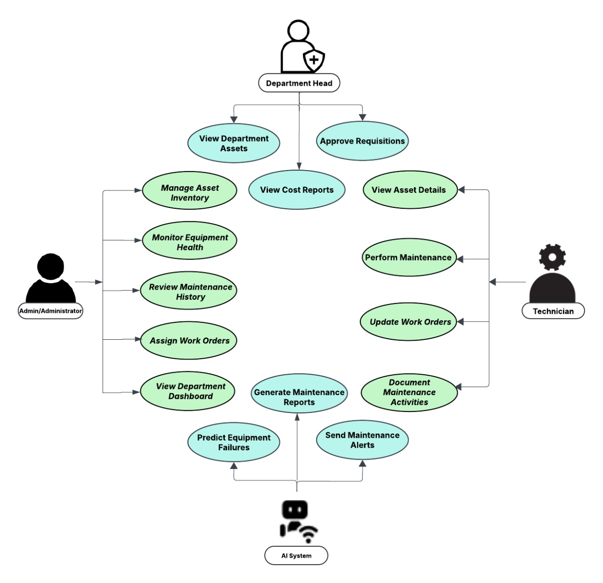
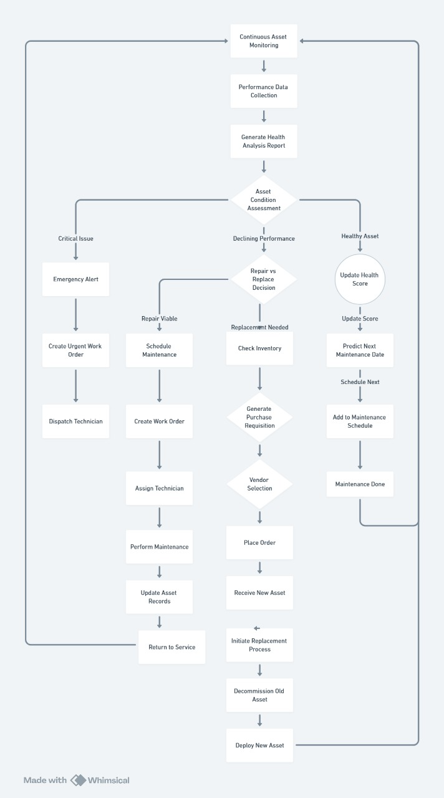

# ByteMe_hackgenx

# ByteMe HackGenX - Hospital Management System

## Overview
ByteMe HackGenX is a hospital management system designed to streamline operations such as user management, equipment tracking, blood bank management, and alert monitoring. This system provides an admin dashboard and department-specific dashboards for efficient management.



## Features
- **Admin Dashboard**: Manage departments, users, and equipment.
- **Department Dashboard**: Track staff, schedules, and equipment status.
- **Blood Bank Management**: Monitor blood stock levels and transfer expiring units.
- **Alerts System**: Real-time maintenance alerts and notifications.
- **User Management**: Add, edit, and manage users with roles and departments.

## Installation

1. Clone the repository:
   ```bash
   git clone <repository-url>
   cd ByteMe_hackgenx-main

2.Install dependencies:

 npm install

 Start the MongoDB server: Ensure MongoDB is running locally or update the connection string in config/db.js:
 npx nodemon app.js

 Open the application in your browser:
 http://localhost:4000

 


3.Install dependencies:

Start the MongoDB server: Ensure MongoDB is running locally or update the connection string in config/db.js.

Start the application:

Open the application in your browser:

Project Structure:
ByteMe_hackgenx-main/
├── config/
│   └── [db.js](http://_vscodecontentref_/1)                # Database connection
├── models/
│   └── [user.js](http://_vscodecontentref_/2)              # User schema and model
├── public/
│   ├── assets/                                             # Static assets (CSS, JS)
│   └── [index.js](http://_vscodecontentref_/3)             # Frontend scripts
├── views/
│   ├── [ad_dashboard.ejs](http://_vscodecontentref_/4)     # Admin dashboard view
│   ├── [dashboard.ejs](http://_vscodecontentref_/5)        # Department dashboard view
│   ├── [bloodbank.ejs](http://_vscodecontentref_/6)        # Blood bank view
│   ├── [index.ejs](http://_vscodecontentref_/7)            # Login page
│   └── [register.ejs](http://_vscodecontentref_/8)         # Registration page
├── [app.js](http://_vscodecontentref_/9)                   # Main server file
├── [package.json](http://_vscodecontentref_/10)             # Project metadata and dependencies
└── [README.md](http://_vscodecontentref_/11)                # Project documentation

Dependencies
Express: Web framework for Node.js.
EJS: Templating engine for dynamic HTML rendering.
Mongoose: MongoDB object modeling tool.
Morgan: HTTP request logger middleware.
Body-Parser: Middleware for parsing incoming request bodies.

Usage
Admin Dashboard:
Navigate to /ad_dashboard to manage departments, users, and equipment.

Department Dashboard:
Navigate to /dashboard for department-specific operations.

Blood Bank:
Navigate to /bloodbank to monitor and manage blood stock.

Alerts:
Navigate to /alerts to view maintenance alerts.


Resources for AI Model:-
1. *Equipment Failures Impact*: "Medical equipment failures cost hospitals $7,200 per hour in downtime, with 68% showing detectable patterns before breakdown" (IEEE Journal of Biomedical Health Informatics, 2024)

2. *Blood Product Wastage*: "4.4% of blood products expire unused annually, representing $1.2 billion in wastage while shortages exist elsewhere" (Transfusion Medicine Reviews, 2023)

3. *Automation Benefits*: "Hospitals using automated notification systems reduced maintenance response time by 64% and saved staff 5.2 hours weekly per department" (International Journal of Medical Informatics, 2024)

4. *Implementation ROI*: "Predictive maintenance systems saved hospitals an average of $432,000 annually per 300-bed facility by preventing unexpected equipment failures" (Journal of Medical Systems, 2023)

These research-backed points establish the urgency of the problem your solution addresses and demonstrate the potential impact of your implementation, giving judges a clear understanding of your project's value proposition.
